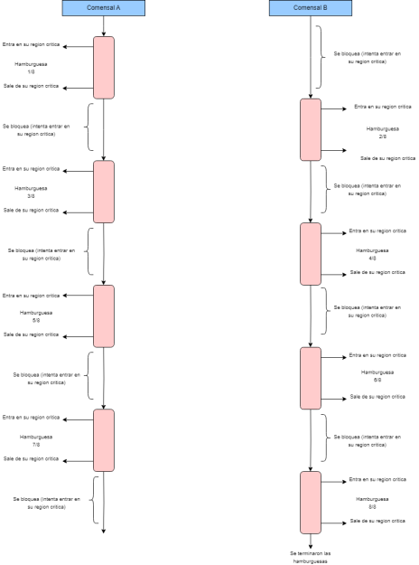

1)  a. Se puede notar que el tiempo de ejecucion del archivo sinhilos.py es al rededor de 5 segundos 
        y el  tiempo de ejecucion del archivo conhilos.py es  al  rededor de 4 segundos.
	Es predecible ya que al ejecutar un codigo con hilos hace que lea el codigo mas rapido ya que puede ejecutar muchas tareas a la vez.

    b. Son tiempos similares, la diferencia es de milisegundos.
    
    c. Lo que pasa es que al descomentar aumenta el tiempo de ejecucion y el valor final deja de dar "0", dando resultados positivos y negativos. 
    Porque al descomentar el ciclo for aumenta la carga del cpu y eso hace que aumente mas el tiempo de ejecucion.

2) a. 
#include <pthread.h>
#include <stdio.h>
#include <stdlib.h>
#define NUMBER_OF_THREADS 2
#define CANTIDAD_INICIAL_HAMBURGUESAS 20
int cantidad_restante_hamburguesas = CANTIDAD_INICIAL_HAMBURGUESAS;
int turno = 0;

void *comer_hamburguesa(void *tid)
{
while (1 == 1)
{ 
while(turno!=(int)tid);
    // INICIO DE LA ZONA CRÍTICA
if (cantidad_restante_hamburguesas > 0)
{
printf("Hola! soy el hilo(comensal) %d , me voy a comer una hamburguesa ! ya que todavia queda/n %d \n", (int) tid, cantidad_restante_hamburguesas);
cantidad_restante_hamburguesas--; // me como una hamburguesa
}
else
{
printf("SE TERMINARON LAS HAMBURGUESAS :( \n");
turno = (turno + 1)% NUMBER_OF_THREADS;
pthread_exit(NULL); // forzar terminacion del hilo
}
    // SALIDA DE LA ZONA CRÍTICA   
turno = (turno + 1)% NUMBER_OF_THREADS;
}
}

int main(int argc, char *argv[])
{
pthread_t threads[NUMBER_OF_THREADS];
int status, i, ret;
for (int i = 0; i < NUMBER_OF_THREADS; i++)
{
printf("Hola!, soy el hilo principal. Estoy creando el hilo %d \n", i);
status = pthread_create(&threads[i], NULL, comer_hamburguesa, (void *)i);
if (status != 0)
{
printf("Algo salio mal, al crear el hilo recibi el codigo de error %d \n", status);
exit(-1);
}
}

for (i = 0; i < NUMBER_OF_THREADS; i++)
{
void *retval;
ret = pthread_join(threads[i], &retval); // espero por la terminacion de los hilos que cree
}
pthread_exit(NULL); // como los hilos que cree ya terminaron de ejecutarse, termino yo tambien.
}

b.